# Market Uygulaması Demo

Projeyi çalıştırmak için aşağıdaki komutları kullanmalısınız.
## 1 -  `npm install`
## 2 -  `npm start`

## Yeni terminal açıp
## 1 -  `npx json-server --watch Veri.json --port 3001`

# PROJEYE AİT GÖRÜNTÜLER
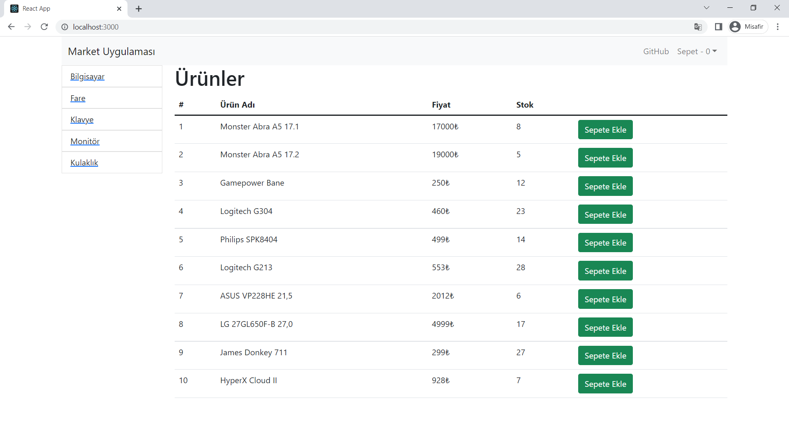  
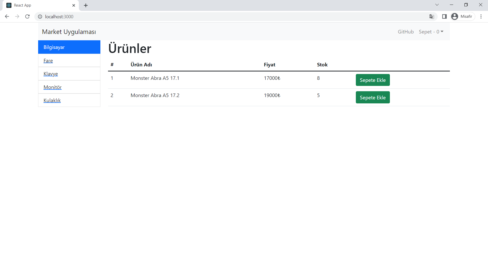  
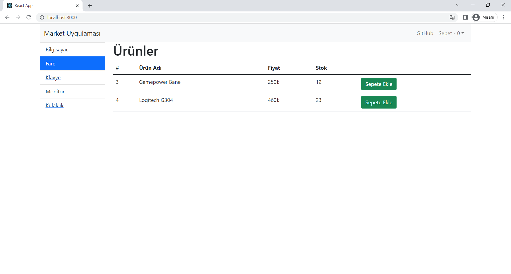  
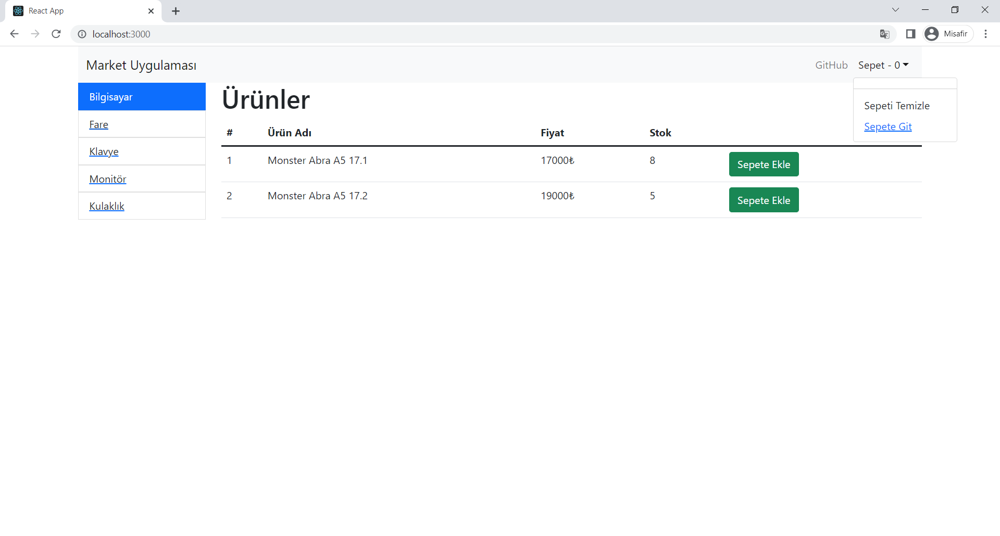  
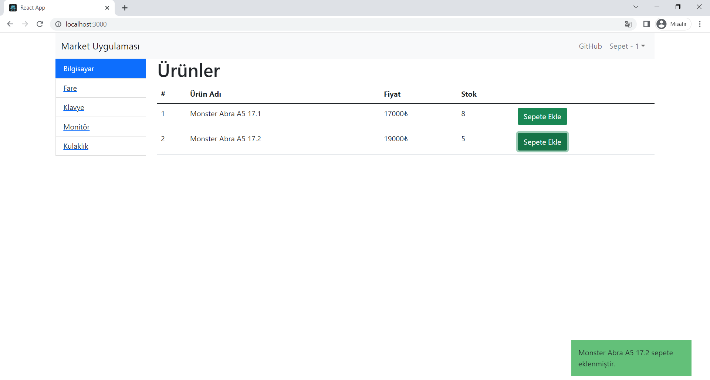  
  
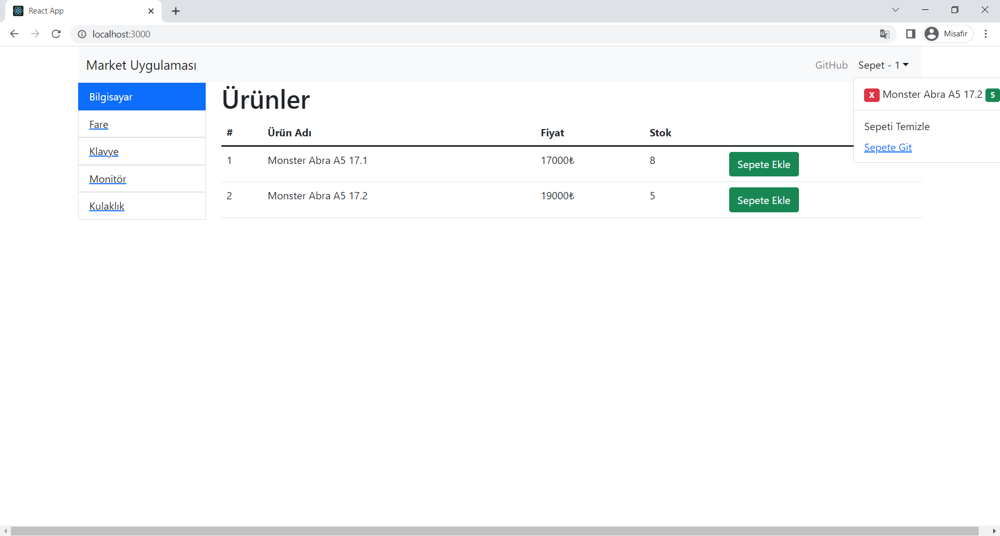  
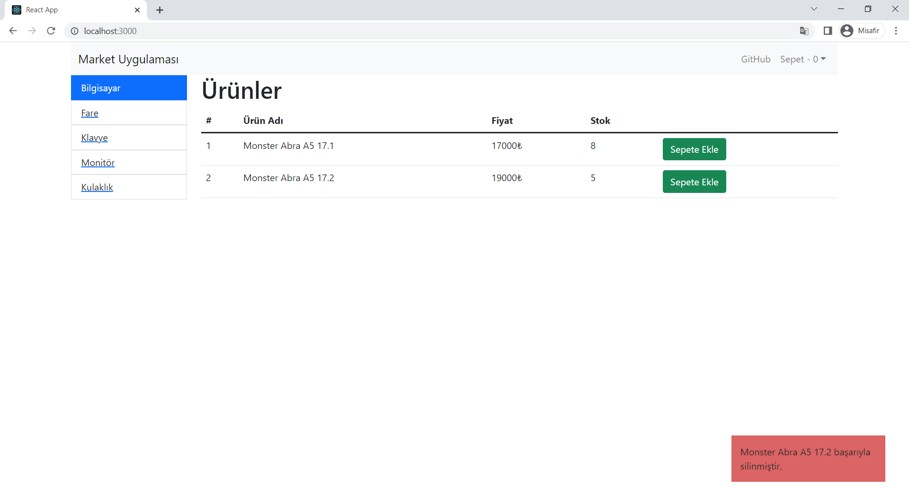  
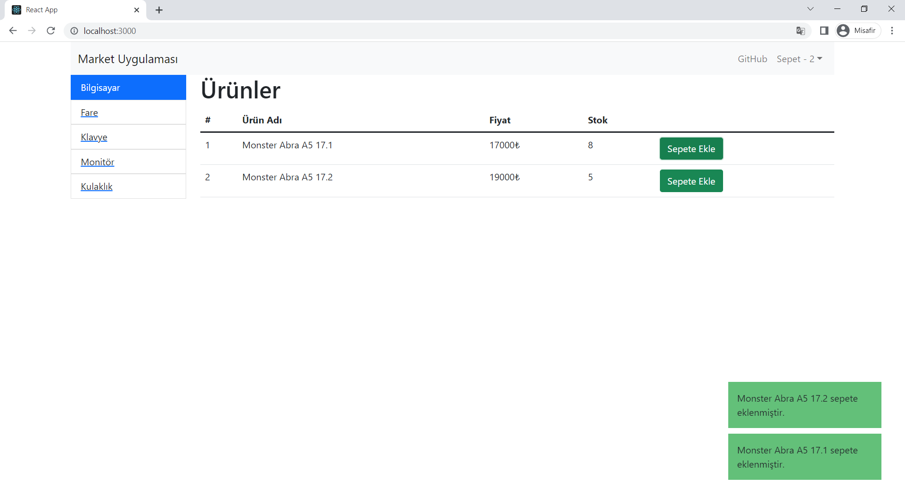  
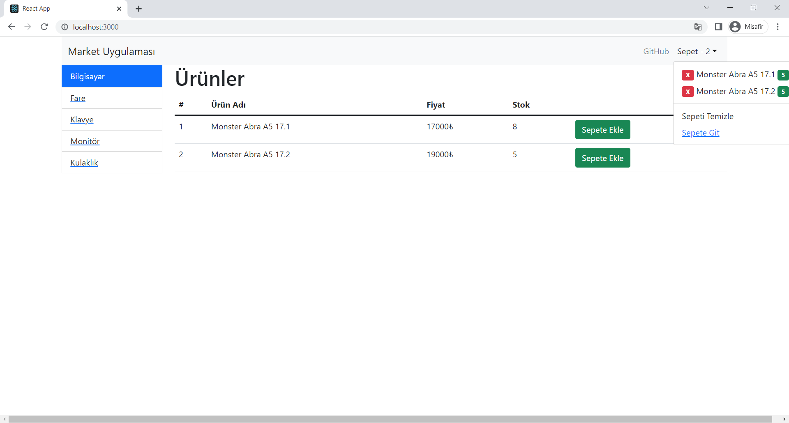  
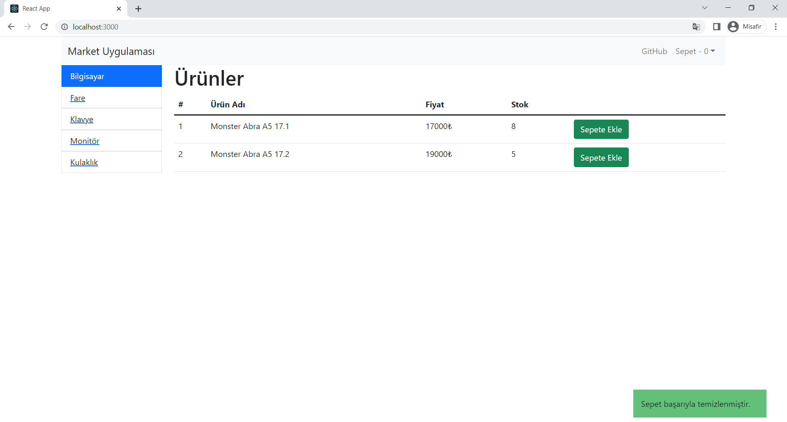  
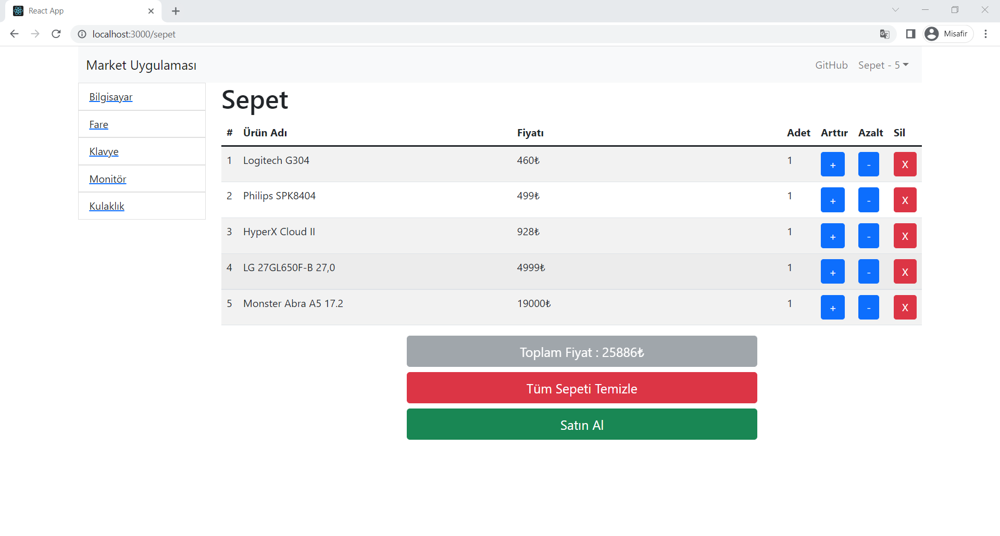  
  
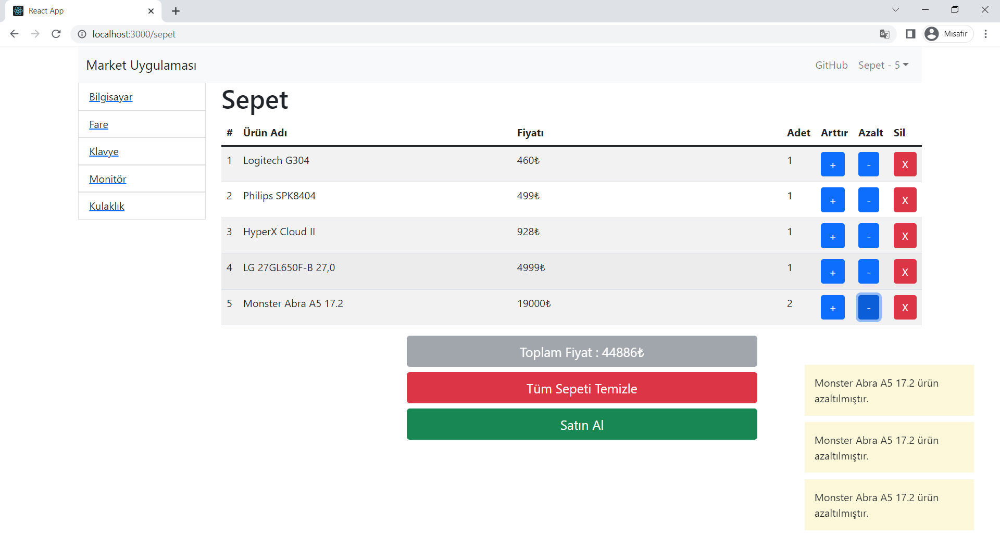  
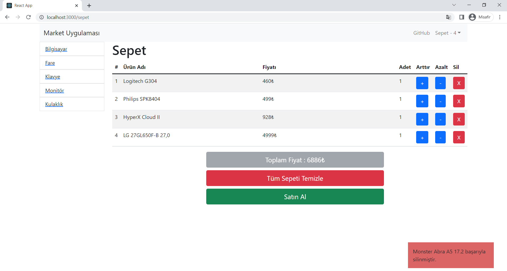  
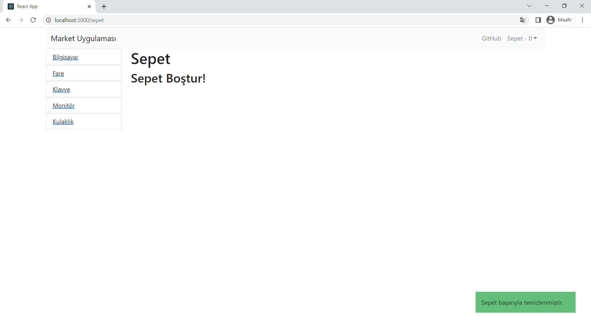  

